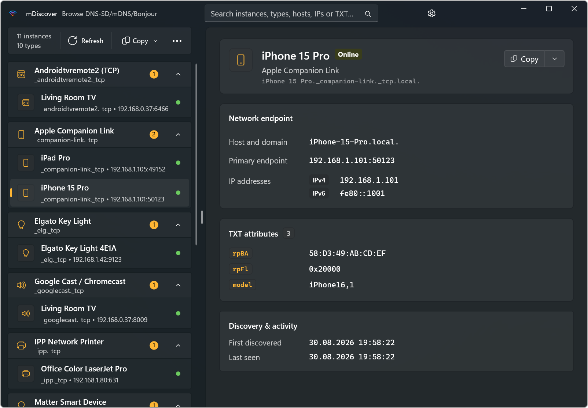
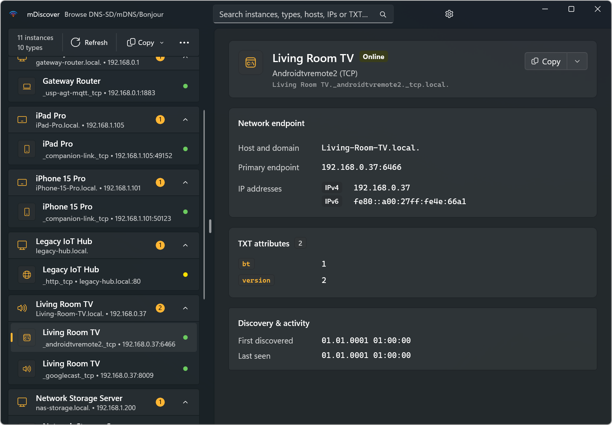
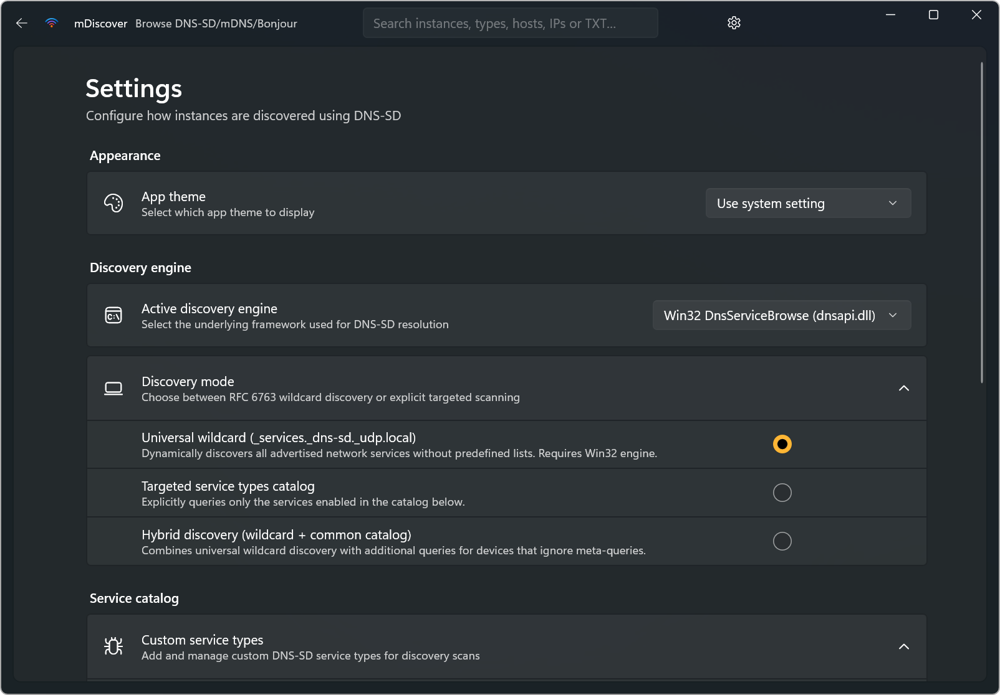

<p align="center">
  
</p>

<h1 align="center">mDiscover</h1>

<p align="center">
  <b>A lightweight, native WinUI 3 tool to discover, inspect, and debug Bonjour, mDNS, and DNS-SD services on your local network.</b>
</p>

<p align="center">
  <a href="https://apps.microsoft.com/detail/9N5LVZJM2ZWN"></a>
  
  
  <a href="LICENSE"></a>
</p>

---

If you work with IoT devices, HomeKit/Smart Home gear, network printers, local development servers, or network services advertising over mDNS (`.local`), **mDiscover** gives you a clear, real-time view of what is running and what attributes they publish.

## Screenshots

<p align="center">
  
  <br />
  <em>Discovery grouped by service type with detailed network endpoint and TXT record inspection</em>
</p>

<p align="center">
  
  <br />
  <em>Organize instances by physical device / host with live online indicators</em>
</p>

<p align="center">
  
  <br />
  <em>Flexible discovery engines (Win32 / WinRT), wildcard / catalog scanning, and customizable service types</em>
</p>

## Features

- **Live DNS-SD discovery**: Scans your local subnet for advertised services in real time.
- **Detailed service inspection**:
  - Service instance names and service types (`_http._tcp`, `_ssh._tcp`, etc.)
  - Hostnames, resolved IPv4 and IPv6 addresses, and port numbers
  - Full TXT record key-value pairs
  - Resolution timing and discovery status
- **Dual discovery engines**:
  - **Win32 engine** (`dnsapi.dll`): Supports universal wildcard discovery (`_services._dns-sd._udp.local`) to find all advertised types without needing a predefined list.
  - **WinRT engine** (`Windows.Devices.Enumeration`): Uses the Windows Runtime device watcher.
- **Search & organization**:
  - Filter across names, types, hostnames, IP addresses, and TXT attributes.
  - Group instances by service type or by physical host / device.
  - Sort by instance name, IP address, port, or discovery order.
- **Export & copy**:
  - Copy individual endpoints, hostnames, IPs, or TXT pairs directly.
  - Export single instances or entire scan results to Markdown, JSON, CSV, or plain text.
- **Modern Windows design**: Built with WinUI 3 and Fluent Design in C#, and compiled with NativeAOT for fast startup and low memory usage.

## Installation

### Microsoft Store
Install directly from the [Microsoft Store](https://apps.microsoft.com/detail/9N5LVZJM2ZWN):

<a href="https://apps.microsoft.com/detail/9N5LVZJM2ZWN">
  
</a>

### Windows Package Manager (WinGet)
```powershell
winget install burnArc.mDiscover
```

## System requirements

- **Operating system**: Windows 10 (version 2004 / build 19041 or newer) or Windows 11
- **Architecture**: `x64` or `ARM64`
- **Network**: Local network connection (Wi-Fi or Ethernet) with multicast traffic enabled

## Building from source

### Prerequisites
- Windows 10 (version 19041 or newer) or Windows 11
- .NET 10 SDK
- Visual Studio 2026 with:
  - **.NET Desktop Development** workload
  - **Windows App SDK** component
  - **C++ Build Tools** (required for NativeAOT compilation)

### Clone & build
```powershell
git clone https://github.com/BernhardMarconato/mDiscover.git
cd mDiscover

# Restore dependencies
msbuild mDiscover.slnx /t:Restore

# Build Debug version (packaged with developer identity)
msbuild mDiscover.slnx /p:Configuration=Debug /p:Platform=x64

# Or build Release with NativeAOT
msbuild mDiscover.slnx /p:Configuration=Release /p:Platform=x64
```

## Contributing

Contributions, bug reports, and suggestions are welcome. Feel free to open an issue or submit a pull request.

## License & privacy

- **License**: Licensed under the [MIT License](LICENSE).
- **Privacy policy**: Read the [Privacy Policy](PRIVACY.md).
